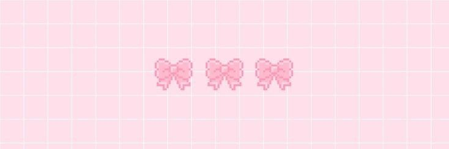

<!-- 🌸 Banner image -->

<!-- 🌸 Interactive rotating typing animation -->

 

  

<!-- 🩷 Pink badges -->

 

<!-- 🌸 Ribbon divider -->

---

## 🌸 About Me

> *"The secret to getting ahead is getting started."* — Mark Twain 🌷

Hey there! I'm **zenken24** — a developer who loves creating fun, cute, and meaningful projects! 🐾

- 🔭 Currently building **[StudyPet](https://github.com/zenken24/StudyPet)** — a gamified study companion
- 🌱 Always learning something new every day
- 💖 I love Python, CLI apps, and making things adorable
- 🐣 Passionate about gamification and helping students succeed

---

## 🛠️ Tech I Love

---

## 🌸 My Projects

| 💖 Project | 🐾 Description |
|:---:|:---|
| 🐾 **[StudyPet](https://github.com/zenken24/StudyPet)** | A gamified CLI study companion with a virtual pet! |

---

## 📊 GitHub Stats

&nbsp;

  

---

<!-- 🌸 Footer wave -->

*Made with 💖 and lots of pink — thanks for visiting!* 🌸

