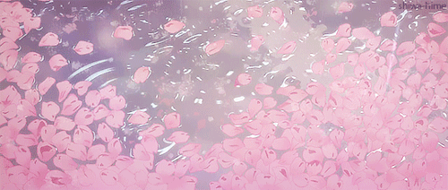
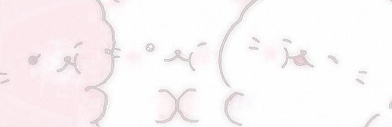
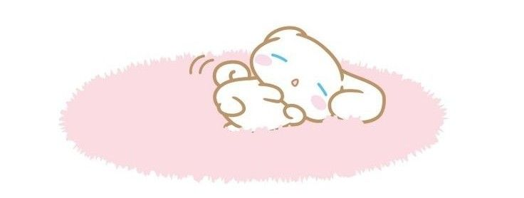
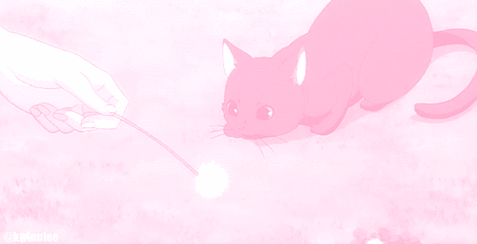

<!-- 🌸 Banner image -->

  
<!-- 🌸 Interactive rotating typing animation -->

 

<!-- 🌸 Ribbon divider -->

---

## 🌸 About Me

> *"The secret to getting ahead is getting started."* — Mark Twain 🌷

Hiiiiiiiii! I'm **Zen!** — a software developer who loves creating fun, cute, and meaningful projects that I might need in everyday lives! I'm very much interested in ML and data science 🐾

- 🔭 Currently building **[StudyPet](https://github.com/zenken24/StudyPet)** — a gamified study companion
- 🌱 Always learning something new every day 
- 💖 I love Python and building fun little apps  
- 🐣 Passionate about gamification and helping students succeed  
- ⚙️ Curious about DevOps and how systems run smoothly behind the scenes  
- 📊 Interested in Data Science and Machine Learning  
- 🚀 Always experimenting with small projects and creative ideas

 

---

## 🛠️ Tech Stack

### Languages

### Web

### Tools

### Learning / Exploring

---
 

## 🌸 My Projects

| 💖 Project | 🐾 Description |
|:---:|:---|
| 🐾 **[StudyPet](https://github.com/zenken24/StudyPet)** | A gamified CLI study companion with a virtual pet! |
| 🐾 **[Improved-Cafeteria-System](https://github.com/zenken24/Improved-Cafeteria-System)** | Improved cafeteria management system project. |
| 🐾 **[Project-Aqua-Recruitment](https://github.com/zenken24/Project-Aqua-Recruitment)** | Recruitment-focused project repository. |
| 🐾 **[cbs-neotalk-2026](https://github.com/zenken24/cbs-neotalk-2026)** | CBS NeoTalk 2026 project repository. |
| 🐾 **[Student-Management-System](https://github.com/zenken24/Student-Management-System-)** | Student management system project. |
| 🐾 **[anika](https://github.com/zenken24/happi-bday-anika)** | Birthday-themed project for Anika. |
| 🐾 **[udita](https://github.com/zenken24/udita)** | Personal project repository. |
| 🐾 **[Legends Of Aetherfall](https://github.com/zenken24/Legends-of-Aetherfall)** | Legends of Aetherfall project repository. |

 

---

## 📊 GitHub Stats

---

<!-- 🌸 Footer wave -->

## 🎧 Coding Vibes

This song is currently powering my coding sessions ☕🎶💘
 
 

<!-- Replace YOUR_SPOTIFY_ID with your Spotify user ID -->
<a href="https://open.spotify.com/track/5rDXfGMWI6S8wkXR0MHsvv?si=9f584460078f4513">

<b>love. - wave to earth</b></a>

  
</a>

 

*Made with 💖 and lots of pink — thanks for visiting!* 🌸
